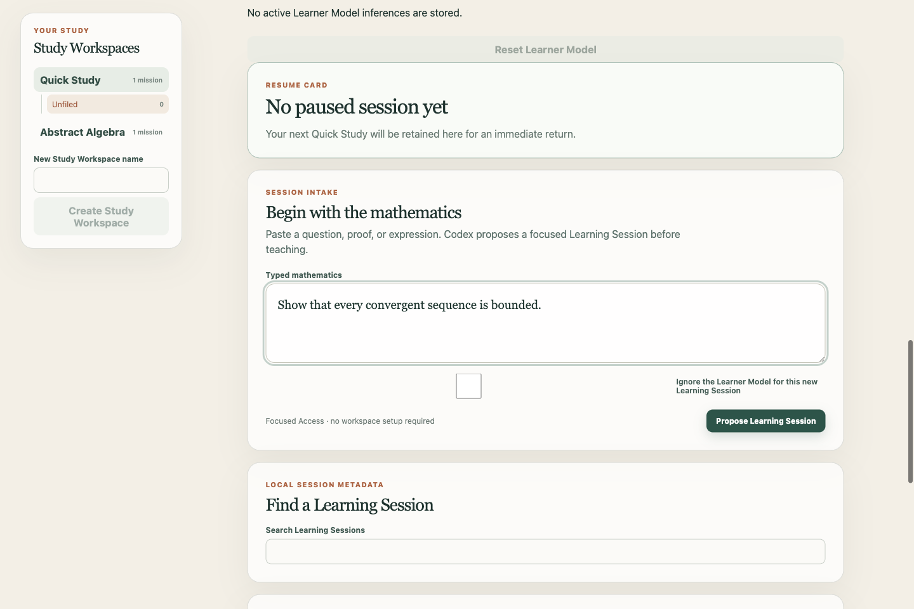
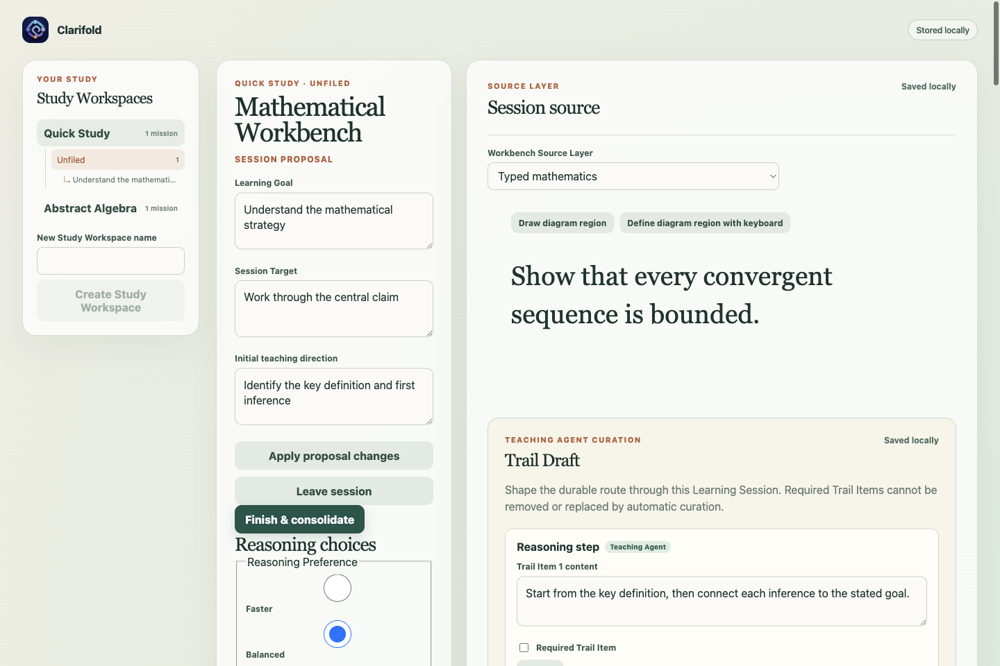
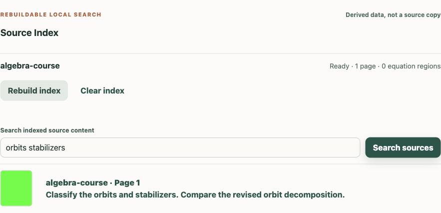

# Clarifold — the advanced mathematics learning workbench

[](https://github.com/jerome-queck/clarifold/actions/workflows/macos-ci.yml)

## Turn the feeling of understanding into evidence

**Know what you understand. Discover what you don't.**

Clarifold is for the Advanced Mathematics Learner: anyone working seriously to
understand advanced mathematical material, regardless of age, credential, or
institution. Bring a question, proof, expression, or source into a focused
Learning Session. Clarifold helps you test an apparent understanding, expose
gaps you did not know you had, and build durable evidence of what you have
examined.

It does not promise mastery, mathematical correctness, or an academic outcome.
Model teaching may be incomplete or wrong. Formal verification applies only to
the exact claim and assumptions checked by the recorded Verifier Environment.

## See the real application

These images are captured from the packaged Clarifold application using
synthetic fixture content. They show the current beta, not a product mockup.



*Start with a question, proof, or expression. Learner work is saved locally by
default.*



*Shape a Learning Session around a goal and target while keeping the source
visible and the workbench state inspectable.*



*Search derived Source Index data without turning it into a replacement copy of
the learner's source.*

## Current beta boundary

Clarifold is an early source-available macOS beta and technical-evaluation
build. The current packaged artifact is an internal, architecture-native
candidate for local and CI evaluation. It is ad-hoc signed, not Developer ID
signed or notarized, and is not a public production download. There is no
hosted preview. Do not bypass Gatekeeper or treat an internal candidate as an
ordinary internet distribution.

The validated beta baseline is an Apple Silicon Mac running macOS 14 Sonoma or
later, with at least 16 GB memory and 12 GB free disk space. Intel and
universal archives are not claimed. See the [macOS beta guide](docs/beta-release.md)
for installation limits, known limitations, recovery, and feedback guidance.

Codex model access is optional for local study but required for model teaching.
When model access is unavailable, Clarifold keeps local sessions, sources,
search, and editing available through Local Working Mode. Optional model access
and external research can leave the Mac; local-first does not mean every
operation is offline. Learners control what they save, send, export, and
delete.

## What stays under your control

The built-in Quick Study Study Workspace is the home for loose work. Learners can later file a session into a named Study Workspace and Study Mission without replacing the session or losing its Learning Goal, Session Target, or return context.

Application state uses Clarifold's local Electron `userData` directory. Use `CLARIFOLD_DATA_DIR` for isolated development or diagnosis; the one-beta `QUICK_STUDY_DATA_DIR` compatibility alias is deprecated and must not point at imported learner sources. On a first default launch, Clarifold stages and validates existing Quick Study data without deleting or changing the old rollback source. Do not commit learner data, credentials, or local `.env` files. Optional model access and external research are separate from local source and session work; see the [privacy notice](PRIVACY.md) and [beta guide](docs/beta-release.md) for the current boundaries and recovery paths.

- Durable application state stays local by default.
- Linked Sources remain in their original locations; Personal Notes are not silently sent through ordinary Teaching Moves.
- Model work is explicit, bounded, cancellable, and recoverable. A lost model connection does not disable local study or silently retry spending.
- Formal results identify the exact statement, assumptions, and Verifier Environment that were checked. They are not a universal correctness label.

Read the [privacy notice](PRIVACY.md) for current data handling and external-service boundaries, and the [security policy](SECURITY.md) for private vulnerability reporting and good-faith testing limits.

Accessibility is a product requirement. The current build uses semantic
controls, accessible names, keyboard-operable primary journeys, and visible
status and error messages where those capabilities are implemented. This is
not a WCAG conformance claim. Report an accessibility or usability barrier
through the [public issue chooser](https://github.com/jerome-queck/clarifold/issues/new/choose)
without attaching private learner or source data.

## Source-available license and brand

Clarifold is source available under the [PolyForm Noncommercial 1.0.0
license](LICENSE.md), not an open-source license. The license permits
noncommercial use, including personal study, research, experimentation, and
use by qualifying noncommercial organizations. It does not grant commercial
permission. Request written, case-by-case permission at
[licensing@jeromegroup.org](mailto:licensing@jeromegroup.org) before commercial
use; an inquiry grants no rights.

Permission to use the software and permission to use the Clarifold name, icon,
or product identity are separate decisions. The [brand and copyright notice](NOTICE)
explains the boundary. Required dependency and Verifier Environment attributions
are in [third-party notices](THIRD_PARTY_NOTICES.md).

## Feedback, safety, and participation

- Report a bug, learning-experience proposal, mathematical-accuracy concern, or accessibility/usability barrier through the [public issue chooser](https://github.com/jerome-queck/clarifold/issues/new/choose). Do not include learner records, source documents, Personal Notes, credentials, secrets, or another person's private data.
- Report a suspected vulnerability through [GitHub Private Vulnerability Reporting](https://github.com/jerome-queck/clarifold/security/advisories/new) or [security@jeromegroup.org](mailto:security@jeromegroup.org). Do not put sensitive findings in a public issue.
- Use the [Code of Conduct](CODE_OF_CONDUCT.md) and its private reporting route for conduct concerns. Privacy questions belong with the [privacy notice](PRIVACY.md); commercial requests belong with the licensing contact.
- Clarifold currently accepts structured feedback and approved maintainer work, not unsolicited outside code, design, icon, documentation, or substantial mathematical-content contributions. The [contribution guide](CONTRIBUTING.md) explains the ownership and review boundary.

## Developer gateway

Start with the [development guide](docs/development.md) for supported setup,
commands, verification, packaging, smoke tests, and troubleshooting. Use the
[architecture guide](docs/architecture.md) for stable runtime responsibilities,
persistence, public seams, and trust boundaries. The [evaluation guide](evaluation/README.md)
owns candidate evidence and learning-evaluation procedures; the [coding
standards](CODING_STANDARDS.md) define the engineering and review contract.

The shortest build-from-source path is:

```sh
npm ci
npm run dev
```

For the complete verification order, supported Node versions, isolated data
directories, packaging, and smoke-test commands, use the [development guide](docs/development.md)
and the executable [package scripts](package.json). The repository's [macOS CI](.github/workflows/macos-ci.yml)
is the authoritative hosted verification surface.

## Project status

The current focus is a trustworthy local-first beta: durable learner state,
honest model and verification boundaries, accessible critical journeys, and
evidence-backed packaged candidates. Only maintainer-approved GitHub issues
represent planned work. Signed and notarized public distribution, hosted
services, commercial terms, and broader platform support remain future gates
with no promised dates.

Clarifold is maintained by Jerome Queck. Copyright and legal boundaries are
described in [NOTICE](NOTICE), the [license](LICENSE.md), and the linked policy
documents above.
