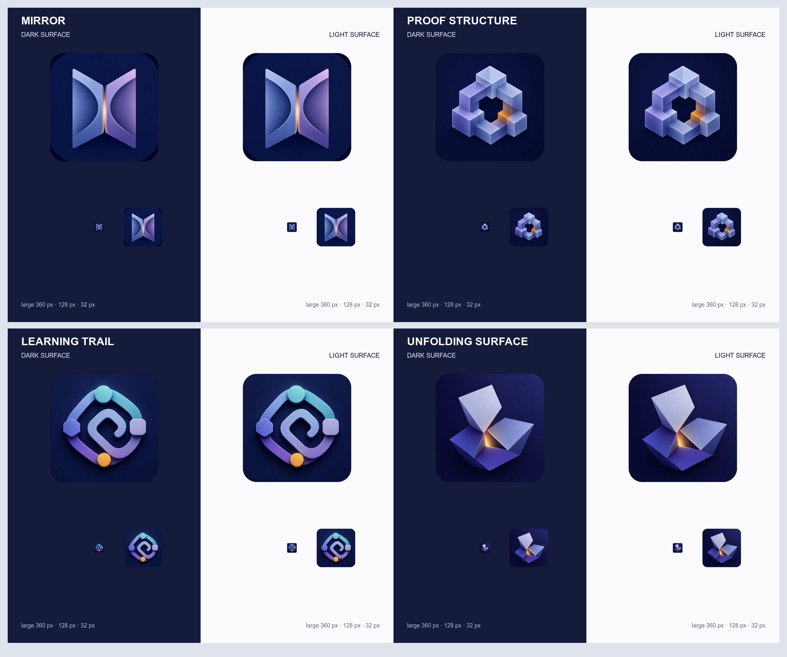
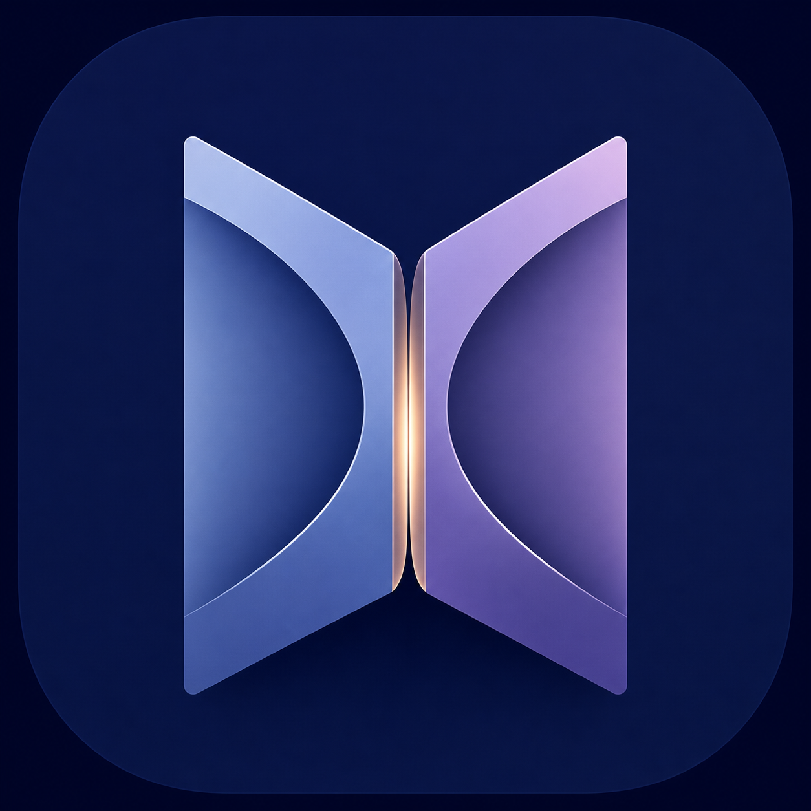
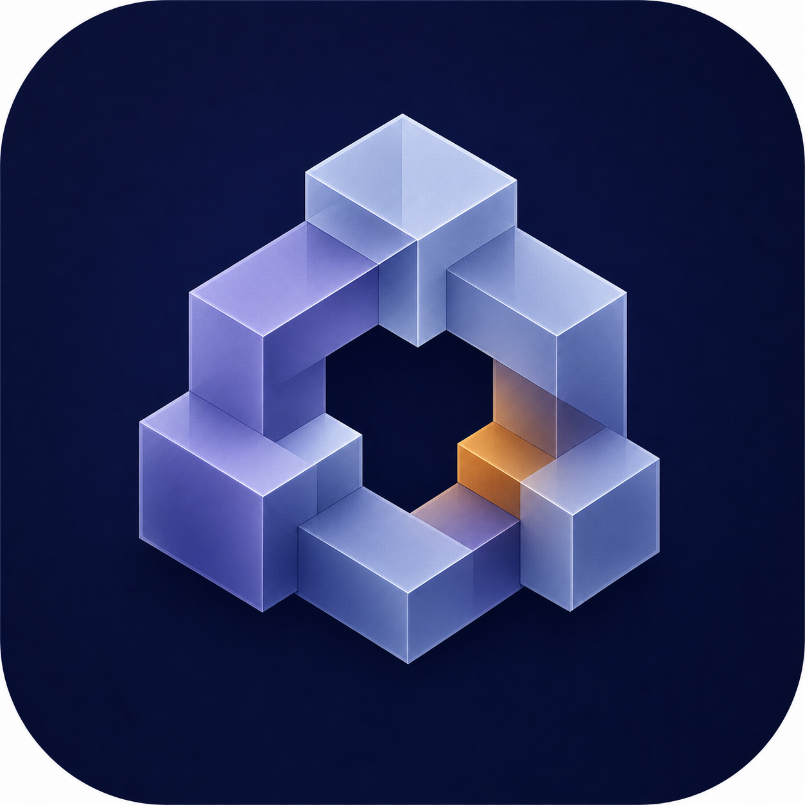
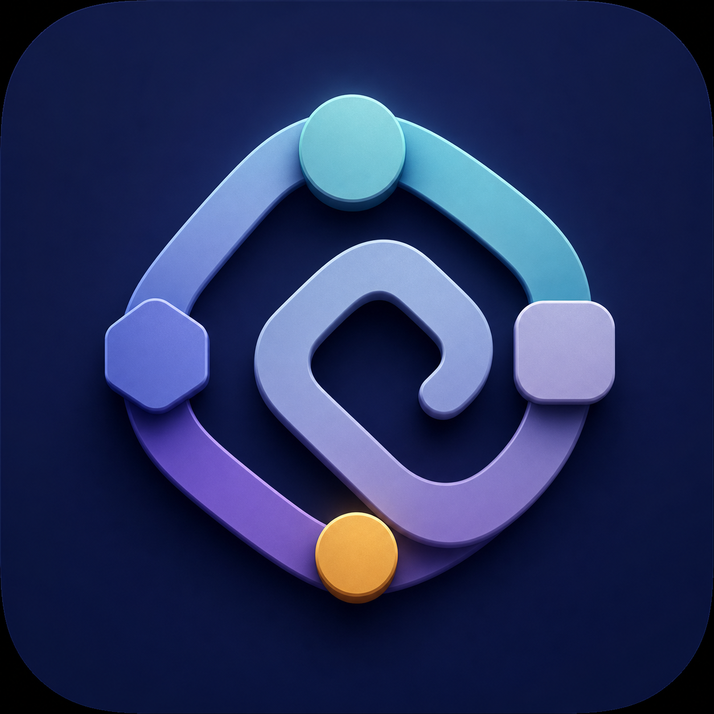

# Clarifold icon candidate review

This is the exploratory review packet for [issue #98](https://github.com/jerome-queck/clarifold/issues/98). It contains four materially different directions for the Clarifold app icon. No candidate is an official asset, is wired into the application, or is adopted for the repository identity. Official selection remains the human gate in [issue #99](https://github.com/jerome-queck/clarifold/issues/99).

## Comparison board

The board shows each candidate against dark and light surrounding surfaces, with explicit large 360 px, 128 px, and 32 px checks on each surface. The rounded-corner mask is presentation-only: it removes generated corner fill so the surrounding surface can be evaluated cleanly without changing the candidate mark.

The source candidate images are available at 1254 × 1254 px. Derived previews cover the macOS-relevant review sizes: 1024, 512, 256, 128, 64, 32, and 16 px. They are review derivatives, not application icon resources.

## Candidate directions

### Mirror

Two opposing curved planes face one another across a narrow illuminated seam. The intended reading is reflective examination: the learner can compare what appears understood with the structure that remains to be examined.

- Recognition strength: the paired silhouette and central seam remain distinct at 32 px; the 16 px view is still symmetric but loses most surface detail.
- Accessibility and recognition concern: the symmetry and inward curves may be read as an open book, doorway, or bow tie. The lavender/blue distinction must not carry the meaning by itself.
- Tradeoff: this direction is calm and memorable, but its literal mirror association may compete with Clarifold's mathematics-learning context.

### Proof structure

Interlocking blocks form a supported chain around an open center. The structure suggests claims, dependencies, and an honest unresolved space rather than a completion badge.

- Recognition strength: the open center and block silhouette survive at 32 px; at 16 px the amber accent disappears, leaving the structural ring.
- Accessibility and recognition concern: the perspective blocks may read as architecture or a puzzle. The opening and support relationships remain available without color.
- Tradeoff: this is the most explicit proof metaphor, but it is visually denser and less immediately soft or curious than the other directions.

### Learning trail

A single continuous path moves through substantial waypoints and turns inward toward a quiet gap. The intended reading is visible, revisitable progress rather than a finish line.

- Recognition strength: the loop and four waypoint shapes create a strong 32 px silhouette; the 16 px view retains the loop but not the waypoint colors.
- Accessibility and recognition concern: the inner turn can be mistaken for an arrow or generic progress symbol. No arrowhead or success check is intentional; this should be tested with people who have not seen the rationale.
- Tradeoff: this direction connects most directly to Learning Trail language, but it risks looking like navigation or a progress tracker.

### Unfolding surface

Broad planes open around a small illuminated gap. The intended reading is clarity emerging as a mathematical surface is unfolded and inspected, with the gap left discoverable rather than declared solved.

- Recognition strength: the four-plane silhouette remains legible at 32 px; at 16 px the opening is still visible, while the plane boundaries merge.
- Accessibility and recognition concern: the perspective and asymmetry may read as a flower or folded paper. The gap and silhouette should remain understandable without relying on the warm highlight.
- Tradeoff: this is the most distinctive expression of “Clarifold,” but it needs the most small-size and cross-context testing.

## Review checklist

- Compare the four directions side by side before considering any refinement.
- Inspect 1024, 512, 256, 128, 64, 32, and 16 px previews on both dark and light surrounding surfaces.
- Judge silhouette, recognition, contrast, and color-independent meaning separately. Do not treat glow or color as a substitute for shape.
- Check that no direction implies guaranteed mastery, universal correctness, generic tutoring, or an AI assistant.
- Confirm provenance and rights notes in [`provenance.md`](provenance.md) before selecting a direction.
- Record the human decision in issue #99. Until that decision is recorded, do not copy any candidate into application, packaging, repository identity, or release assets.

## Preview files

Each candidate has review previews in [`previews/`](previews/). The standard-size names are explicit, for example [`mirror-16.png`](previews/mirror-16.png), [`mirror-128.png`](previews/mirror-128.png), and [`mirror-1024.png`](previews/mirror-1024.png).
